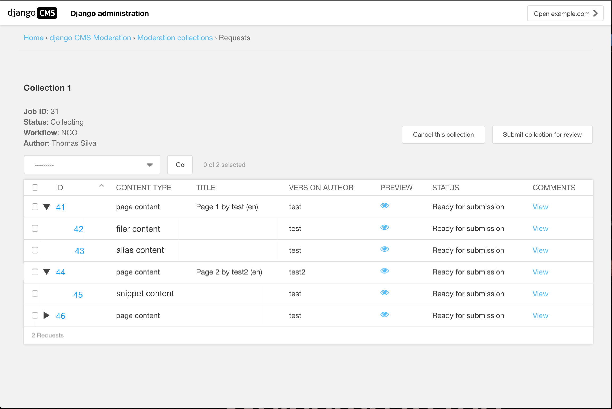

.. _tree_admin:

Tree Admin
================================================

Add Children To Collection
------------------------------------------------
The CollectionItemsView class from `views.py` provides a way, when adding a Page to a :ref:`moderation_collection` of also adding any drafts from other content-types that are included as plugins in any placeholders on that Page.

This poses certain UI / UX challenges. The default implementation meant that these drafts would simply be added to the Collection as part of the list of content objects in that collection. However there are several problems with this:

 1. There's no obvious link between the listed items and the pages that contain them and they would thus be indistinguishable from content objects that may have been added without being part of any page.
 2. Reviewers aren't necessarily interested in all of that detail. They would want to simply be able to moderate the page, including all of it's content. So all of the detail may be undigestible for them.

The solution for these problems that has been implemented is to rework the admin as a TreeBeard admin view. This creates a tree for each collection which would map the relationships between items that are added as part of a page and that page.

The outcome of this is that a given content object may be appear repeatedly within the tree, even though it is only added to the Collection once.
e.g. If a `child` that is added to a :ref:`moderation_collection` as part of both `parent1` and `parent2` and individually via that `child` content-type's admin, it would then appear three times within the tree. Removing the `child` from the :ref:`moderation_collection` would remove it from all/any parts of the tree it was part of.

The tree structure is shown visually using tabbed spacing to indicate nesting.

The `ModerationRequestTreeAdmin` class in `admin.py` replaces the original `ModerationRequestAdmin`, providing TreeBeard integration as described above.

The `delete_selected_view` function of that class ensures that removing an item from the :ref:`moderation_collection` updates the tree correctly via means of a recursive function, `_traverse_moderation_nodes`.
